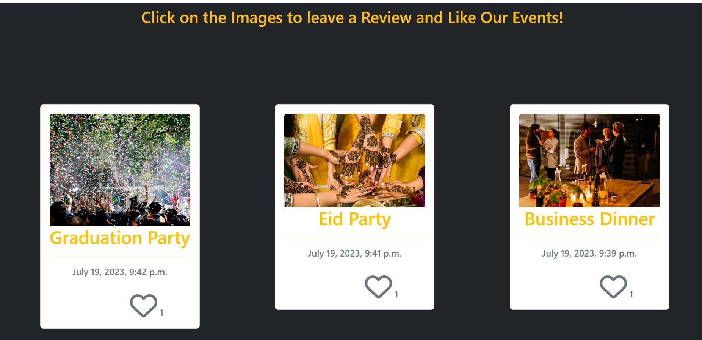
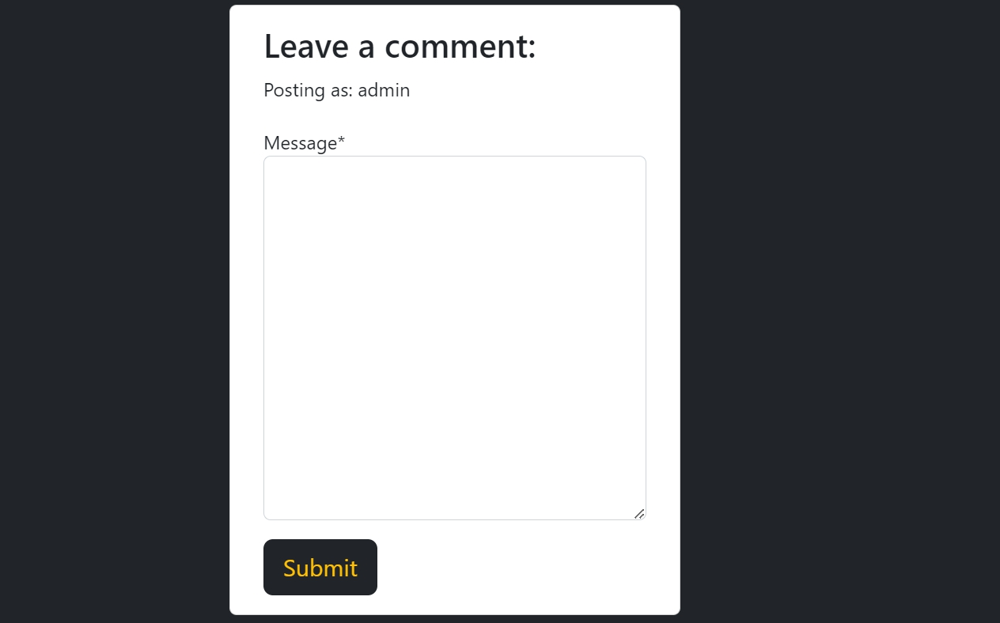
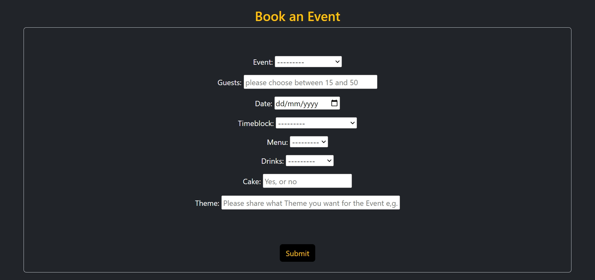
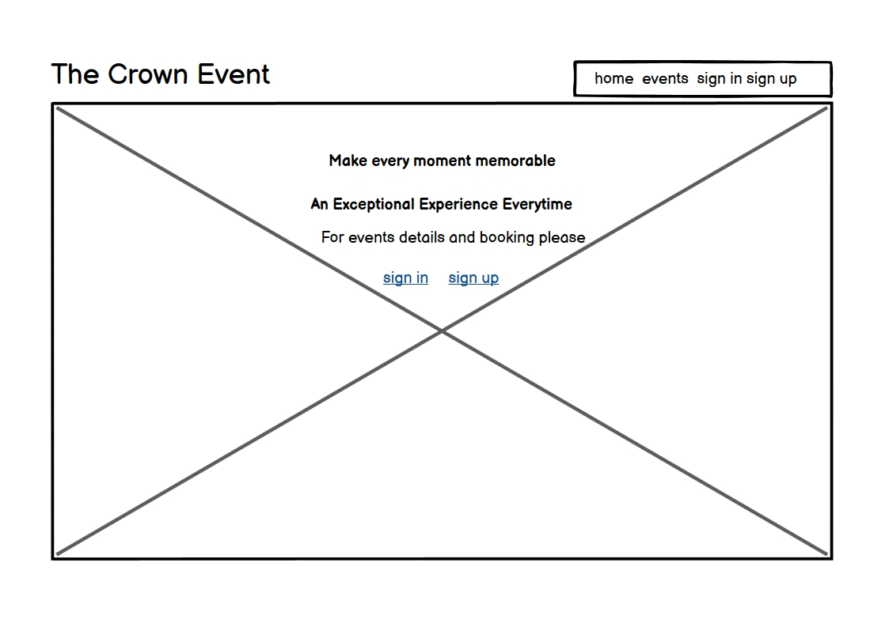
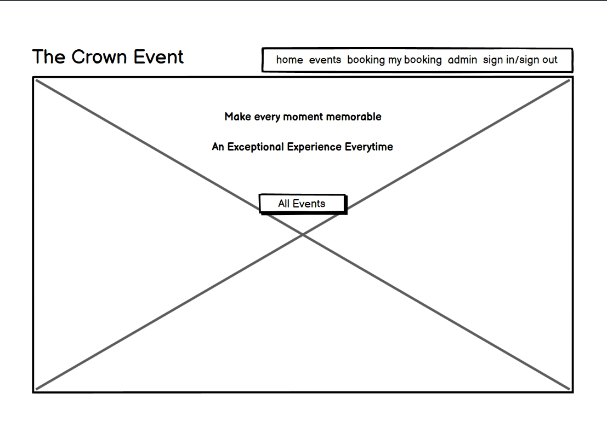
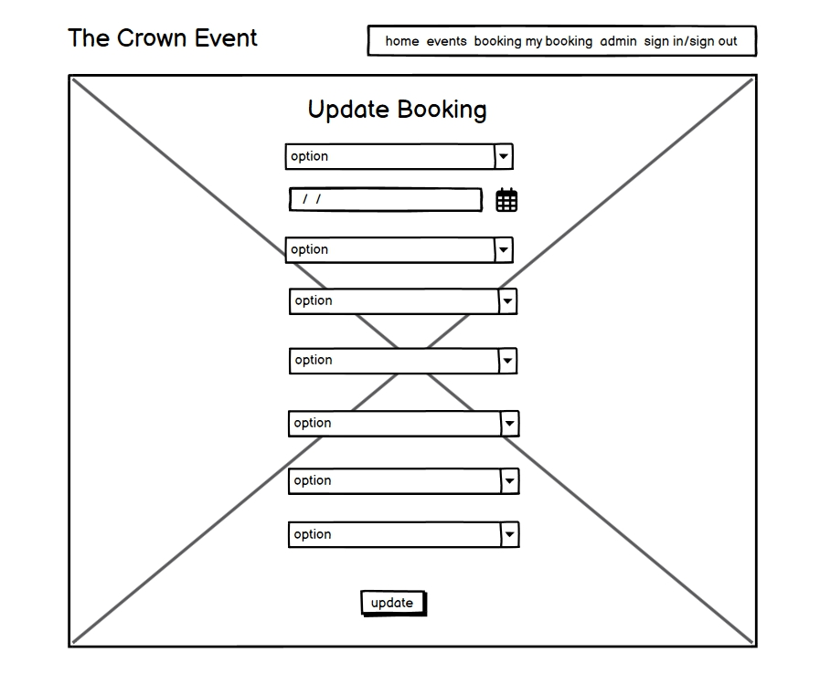
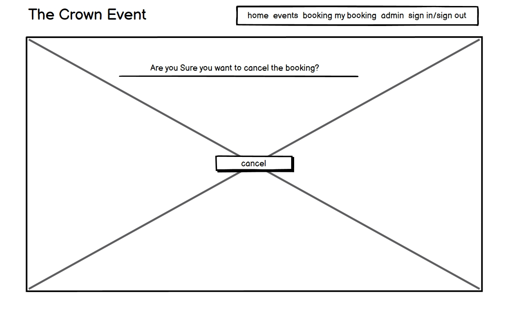
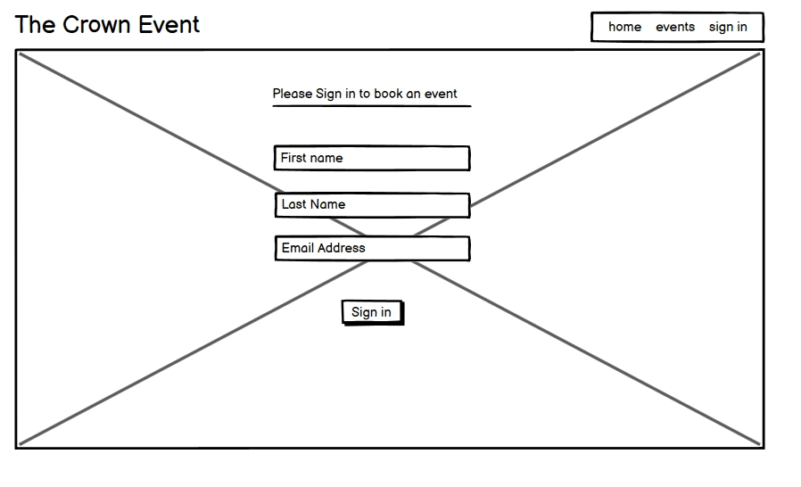

<h1 align = "center">THE CROWN EVENTS</h1><h3 align = "center">MAKE EVERY MOMENT MEMORABLE   AN EXCEPTIONAL EXPERIENCE EVERY TIME</h3> 

# Index - Table of Contents

- [Introduction](#introduction)  
- [User Experience (UX)](#user-experience-ux) 
- [Design](#design)
- [Agile Methodology](#agile-methodology)
- [Features](#features)
    - [Registration](#Registration)
    - [Home](#Home)
    - [Events](#Events)
    - [Booking](#Booking)
- [Features to be Implemented](#Features-to-be-Implemented)   
- [Technologies](#technologies)
- [Development & Testing](#testing)
- [Deployment](#deployment)
- [Credits](#credits)

## User Expreience (UX)

## Intoduction
## Features
### Existing Features

#### Registration
  
  

#### Home Page
  

#### Events Page
  

#### Events List
  
  

#### Events Detail
  
  

#### Likes on Event
  

#### comments on Event
  
  

#### Event Booking
  

#### My Bookings
  

#### Booking Update
  

#### Booking Cancel
  

#### User Stories Chart
  

## Design 
#### DataBaseManagementSystem

  

## Agile Methodology
[The Crown Event Agile Tool](https://github.com/users/ru22-14/projects/5)

## Technologies Used

#### languages

-   [HTML5](https://en.wikipedia.org/wiki/HTML5)
-   [CSS3](https://en.wikipedia.org/wiki/Cascading_Style_Sheets)
-   [Python](https://www.python.org/)

#### Frameworks & Liabraries

- [Google Fonts:](https://fonts.google.com/) used for the Roboto and Lato font.
- [Font Awesome:](https://fontawesome.com/) was used to add icons and for UX purposes.
- [dbdiagram.io](https://dbdiagram.io/home) was used to create the Entity Relationship diagrams for the application data model.
- [Balsamiq:](https://balsamiq.com/) was used to create the wireframes during design planning.
- [Git:](https://git-scm.com/) was used for version control by utilising the Gitpod terminal to commit to Git and Push to 
   GitHub.
- [GitHub:](https://github.com/) is used as the respository for the project code after being pushed from Git. In addition, for 
   this project GitHub was used for the agile development aspect through the use of User Stories (GitHub Issues) and tracking them on a Kanban board.
- [Django](https://www.djangoproject.com/) was used as the framework to support rapid and secure development of the 
   application.
- [Bootstrap](https://getbootstrap.com/) was used to build responsive web pages.
- [Gunicorn](https://gunicorn.org/) was used as the Web Server to run Django on Heroku.
- [dj_database_url](https://pypi.org/project/dj-database-url/) library used to allow database urls to connect to the postgres 
  db.
- [psycopg2](https://pypi.org/project/psycopg2/) database adapter used to support the connection to the postgres db.
- [Cloudinary](https://cloudinary.com/) used to store the images used by the application.
- [Summernote](https://pypi.org/project/django-summernote/) used to provide WYSIWYG editing on the Hike editing screen.
- [Django allauth](https://django-allauth.readthedocs.io/en/latest/index.html) used for account registration and 
   authentication.
- [Django crispy forms](https://django-crispy-forms.readthedocs.io/en/latest/) used to simplify form rendering.
- [jquery library](https://ajax.googleapis.com/ajax/libs/jquery/1.12.4/jquery.min.js) used to fade out alert messages.
- [Django testing tools](https://docs.djangoproject.com/en/3.2/topics/testing/tools/) used for python mvt testing.
- [Jest](https://jestjs.io/) - used to test jquery in script.js.
- [coverage](https://coverage.readthedocs.io/en/coverage-5.5/) used to check how much of the python code has been covered.

