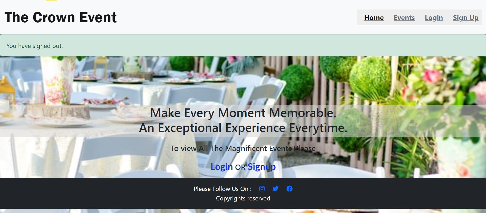
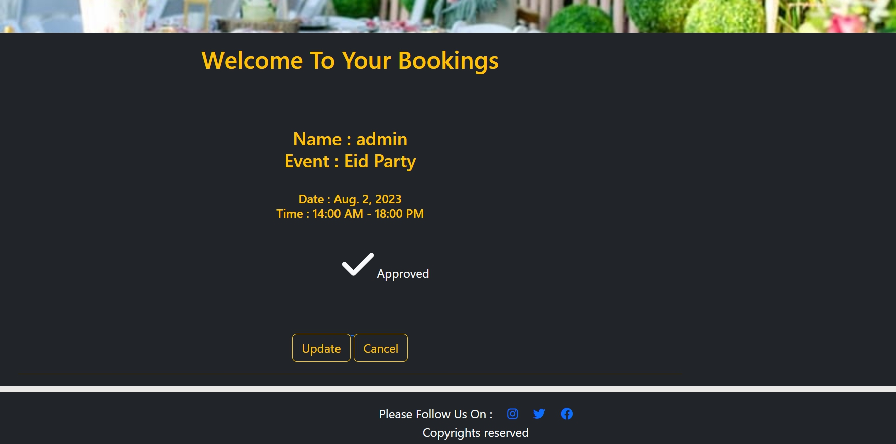
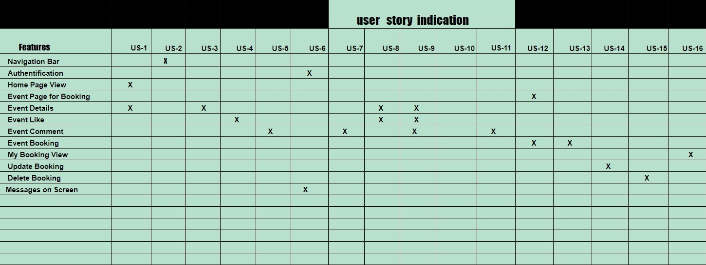
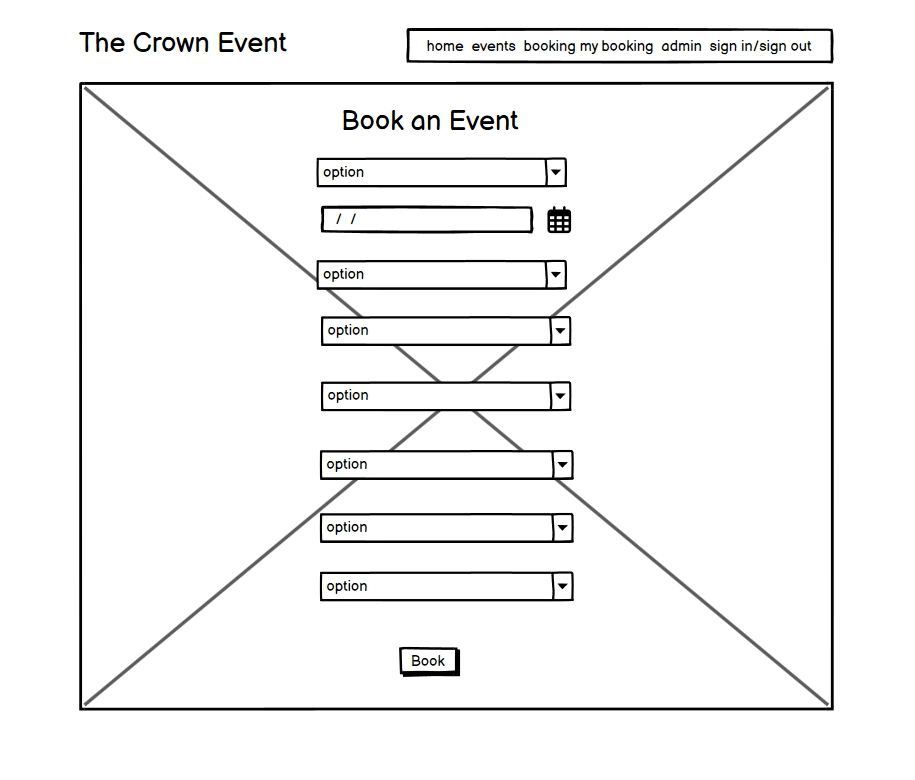
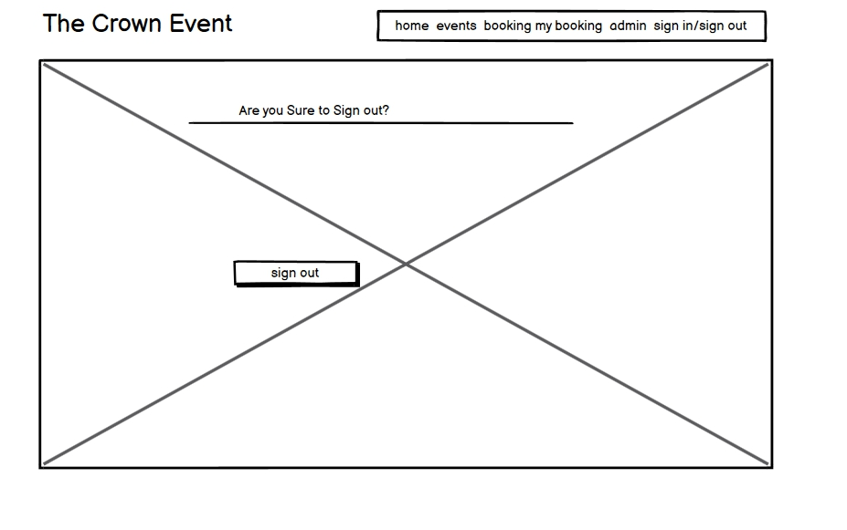
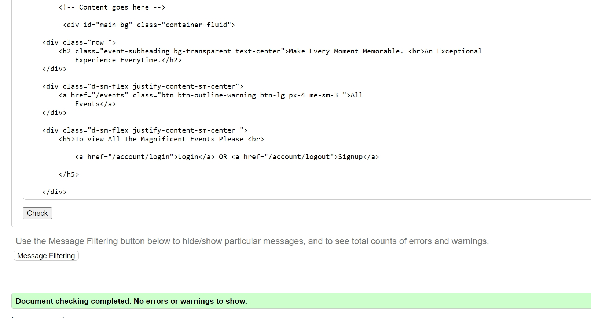
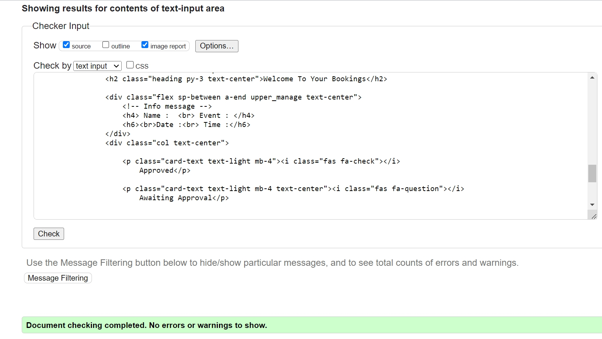
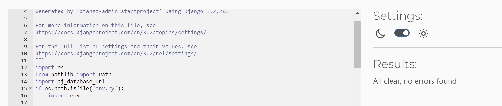
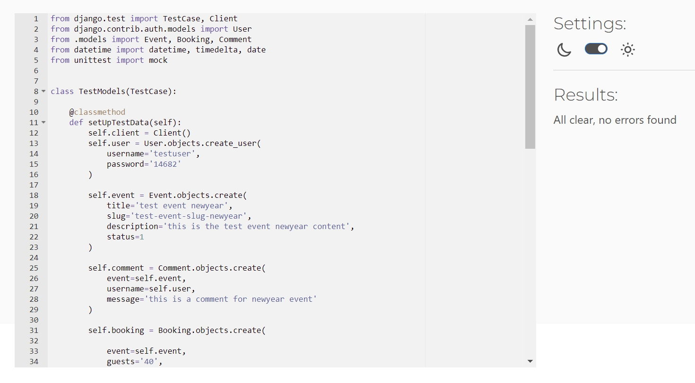
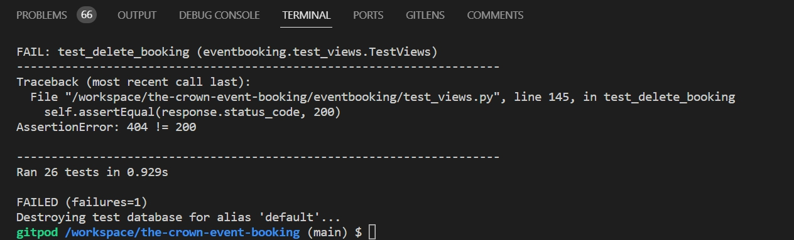

<h1 align = "center">THE CROWN EVENTS</h1><h3 align = "center">MAKE EVERY MOMENT MEMORABLE   AN EXCEPTIONAL EXPERIENCE EVERY TIME</h3> 

# Index - Table of Contents

- [Introduction](#introduction)  
- [User Experience (UX)](#user-experience-ux) 
- [Design](#design)
- [Agile Methodology](#agile-methodology)
- [Features](#features)
- [Features to be Implemented](#Features-to-be-Implemented)   
- [Technologies](#technologies)
- [Testing](#testing)
- [Deployment](#deployment)
- [Credits](#credits)

## User Expreience (UX)

### User Stories 

- 02 : Site Navigation 
    - As a Site User I can see the Navigation bar so that I can easily navigate through the Website. 

- 06 :  Registration
    - As a Site User I can register an account so that I can explore the content and Book an Event. 

- 01 : View Event List
    - As a Site User I can view a list of Event so that I can read the details, likes and comments by other    
      users.  
 
- 03 : Open an Event
    - As a Site User I can click on an event so that I can read the details about the event. 

- 04 : View Likes
    - As a Site User/Admin I can view the number of likes on each event so that I can see which one is 
      popular or viral.  

- 05 : Read Comments
    - As a Site User/Admin I can view comments on an individual event so that I can read the             
      conversation. 

- 07 : Like/Unlike
   - As a Site User I can Like or Dislike an Event post so that I can help in improving the services provided. 

- 08 : Comment on Post
   - As a Site User I can comment on an event post so that I can give suggestions, reviews and recommendations.

- 11 : Approve Comments
   - As a Site Admin I can approve or disapprove comments so that I can filter out objectionable comments and 
     reviews  
   
- 12 : Booking 
   - As a Site User I can navigate to Booking so that I can Book an Event.

- 13 : Booking Approval
   - As an admin I can approve booking so that user can see his/her booking is approved. 

- 16 : View Previous Bookings
   - As a Site user I can check my previous bookings so that i can check the booking, update or delete them. 
   
- 14 : Edit Booking
   - As a Site User I can Edit so that i can update my booking. 

- 15 : Delete Booking
   - As a Site User I can delete my booking whenever i want to cancel my booking 

- 10 : Create Drafts
   - As a Site Admin I can create drafts so that I can add content to them later. 

- 09 : Manage Event Post
   - As a Site Admin I can create, read, update and delete more events, posts and comments so that I can make my 
     Site and Events better and my customers Happy and satisfied. 
      

                    

 

## Intoduction
## Features
### Existing Features

#### Registration

* this section is for registration.
  
  

#### Home Page
  

#### Events Page
  

#### Events List
  
  

#### Events Detail
  
  

#### Likes on Event
  

#### comments on Event
  
  

#### Event Booking
  

#### My Bookings
  

#### Booking Update
  

#### Booking Cancel
  

#### Admin Event Post
  

#### Admin Booking Approval
  

#### Admin Comment Approval
  

#### User Stories Chart
  

## Design 
#### DataBaseManagementSystem

  

## Agile Methodology
[The Crown Event Agile Tool](https://github.com/users/ru22-14/projects/5)

## Technologies Used

#### languages

-   [HTML5](https://en.wikipedia.org/wiki/HTML5)
-   [CSS3](https://en.wikipedia.org/wiki/Cascading_Style_Sheets)
-   [Python](https://www.python.org/)

#### Frameworks & Liabraries

- [Google Fonts:](https://fonts.google.com/) used for the Roboto and Lato font.
- [Font Awesome:](https://fontawesome.com/) was used to add icons and for UX purposes.
- [dbdiagram.io](https://dbdiagram.io/home) was used to create the Entity Relationship diagrams for the application data model.
- [Balsamiq:](https://balsamiq.com/) was used to create the wireframes during design planning.
- [Git:](https://git-scm.com/) was used for version control by utilising the Gitpod terminal to commit to Git and Push to 
   GitHub.
- [GitHub:](https://github.com/) is used as the respository for the project code after being pushed from Git. In addition, for 
   this project GitHub was used for the agile development aspect through the use of User Stories (GitHub Issues) and tracking them on a Kanban board.
- [Heroku:](https://heroku.com/login) is used to deploy the project.  
- [Django](https://www.djangoproject.com/) was used as the framework to support rapid and secure development of the 
   application.
- [Bootstrap](https://getbootstrap.com/) was used to build responsive web pages.
- [Gunicorn](https://gunicorn.org/) was used as the Web Server to run Django on Heroku.
- [dj_database_url](https://pypi.org/project/dj-database-url/) library used to allow database urls to connect to the postgres 
  db.
- [psycopg2](https://pypi.org/project/psycopg2/) database adapter used to support the connection to the postgres db.
- [Cloudinary](https://cloudinary.com/) used to store the images used by the application.
- [Summernote](https://pypi.org/project/django-summernote/) used to provide WYSIWYG editing on the Hike editing screen.
- [Django allauth](https://django-allauth.readthedocs.io/en/latest/index.html) used for account registration and 
   authentication.
- [Django crispy forms](https://django-crispy-forms.readthedocs.io/en/latest/) used to simplify form rendering.
- [jquery library](https://ajax.googleapis.com/ajax/libs/jquery/1.12.4/jquery.min.js) used to fade out alert messages.
- [Django testing tools](https://docs.djangoproject.com/en/3.2/topics/testing/tools/) used for python mvt testing.
- [Jest](https://jestjs.io/) - used to test jquery in script.js.
- [coverage](https://coverage.readthedocs.io/en/coverage-5.5/) used to check how much of the python code has been covered.

## Testing

### Validation Test

- [HTML Validator](https://validator.w3.org/)
  
- 

- Results of testing the Html Templates
   

   
Home Page

   
     
   

   

   
Events Page

     
   

   

   
EventDetail Page

     
   
  
   

   
Booking Page

     
   

   

   
MyBooking Page

     
   
  
   

   
booking Update Page

     
   
 
   

   
Booking Cancel Page

     
   
 
   

   
Account Page

     
   
   

- Result of testing CSS
- [CSS Validator](https://jigsaw.w3.org/css-validator/) 
   

   
CSS Validation

     
   
  

- Results of testing Python Code
- [Python Validator](https://pep8ci.herokuapp.com/)
   

   
Project Settings

     
   

   

   
Project Urls

     
   

   

   
Admin.py

     
   

   

   
Models.py

     
   

   

   
Views.py

     
   

   

   
Urls.py

     
   

   

   
Forms.py

     
   

   

   
Test_Models.py

     
   

   

   
Test_Views.py

     
   

   

   
Test_Forms.py

     
   

   

   
Test_Urls.py

     
   

### Automated Test
   

   
Test Result

     
   

   

   
Failed Test

     
   

- Tests are written for the following files:  

  - [models.py](eventbooking/models.py)  test file: [test_models.py](eventbooking/models_forms.py)
  - [forms.py](eventbooking/forms.py)  test file: [test_forms.py](eventbooking/test_forms.py)
  - [views.py](eventbooking/views.py)  test file: [test_views.py](eventbooking/test_views.py)
  - [urls.py](eventbooking/urls.py)  test file: [test_urls.py](eventbooking/test_urls.py)

- Testing Coverage Report
  
    

    

