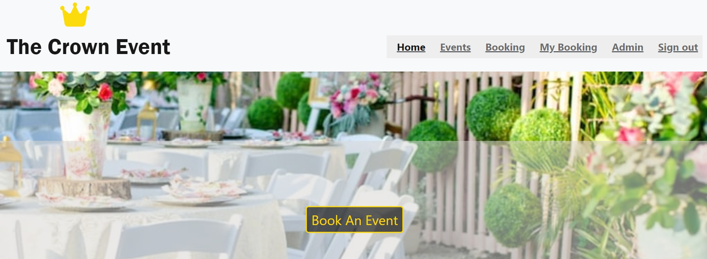
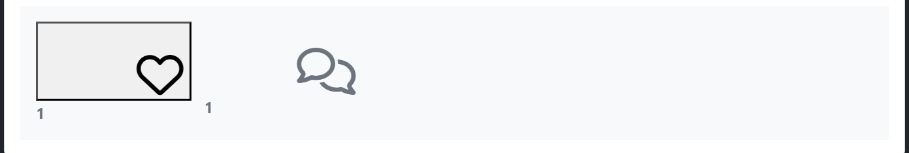
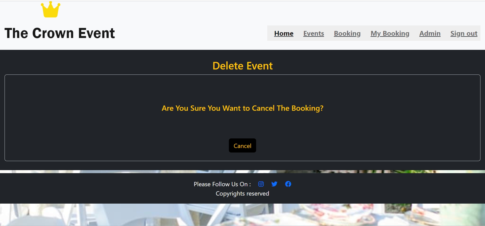

<h1 align = "center">THE CROWN EVENTS</h1><h3 align = "center">MAKE EVERY MOMENT MEMORABLE   AN EXCEPTIONAL EXPERIENCE EVERY TIME</h3> 

# Index - Table of Contents

- [Introduction](#introduction)  
- [User Experience (UX)](#user-experience-ux) 
- [Design](#design)
- [Features](#features)
    - [Registration](#Registration)
    - [Home](#Home)
    - [Events](#Events)
    - [Booking](#Booking)
- [Features to be Implemented](#Features-to-be-Implemented)   
      
- [Technologies](#technologies)
- [Development & Testing](#testing)
- [Deployment](#deployment)
- [Credits](#credits)

## Intoduction
## Features
### Existing Features

#### Registration
  
  

#### Home Page
  

#### Events Page
  

#### Events List
  
  

#### Events Detail
  
  

#### Likes on Event
  

#### comments on Event
  
  

#### Event Booking
  

#### My Bookings
  

#### Booking Update
  

#### Booking Cancel
  

#### User Stories Chart
  

## Design 
#### DataBaseManagementSystem
  

