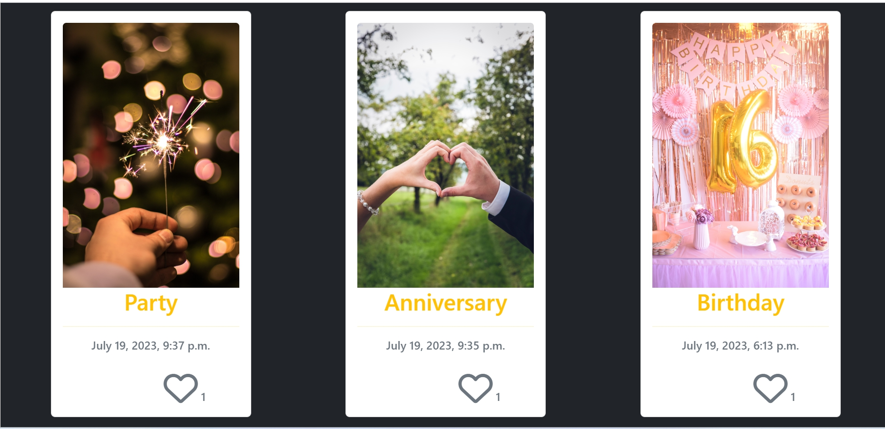
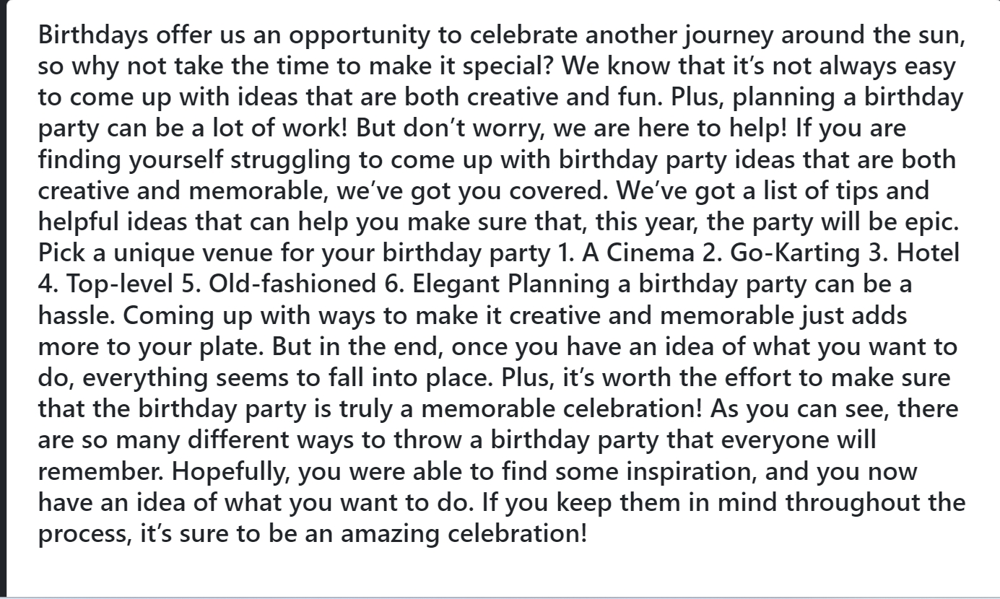
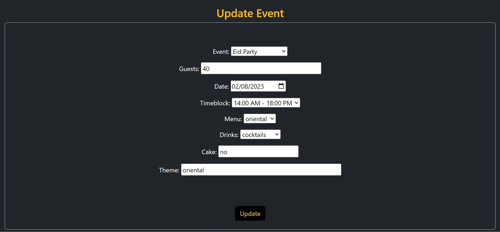
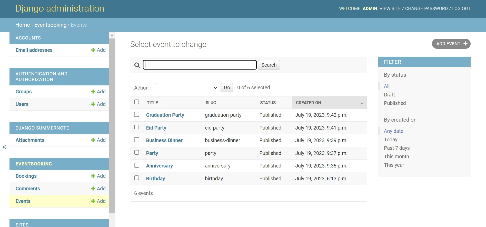
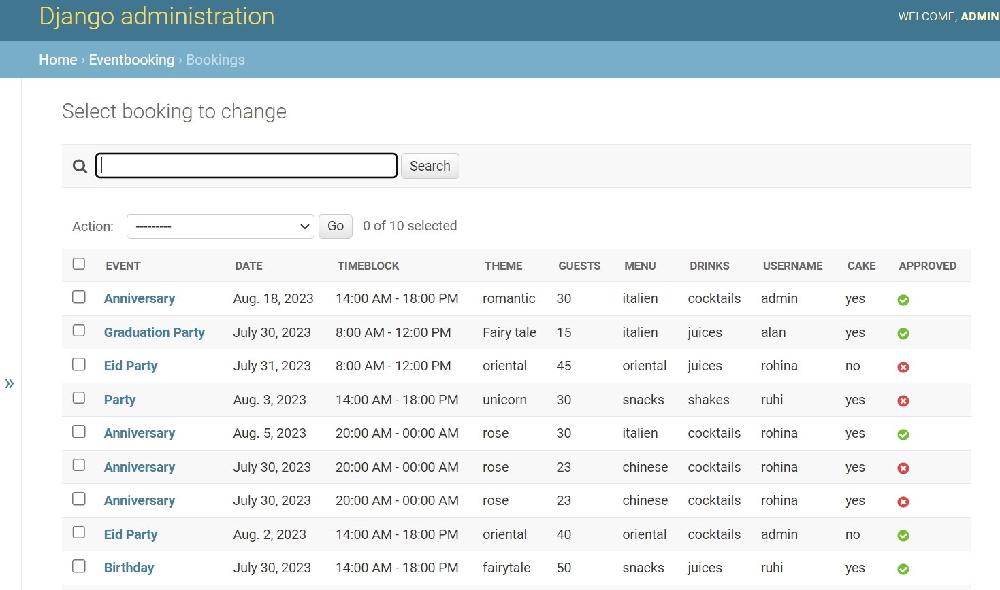
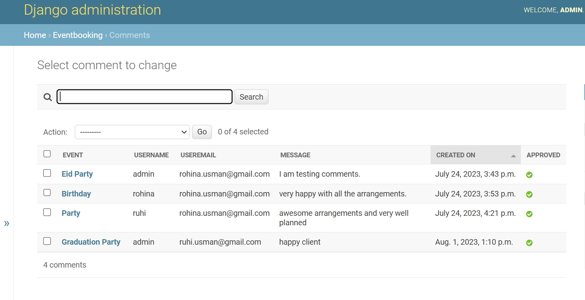
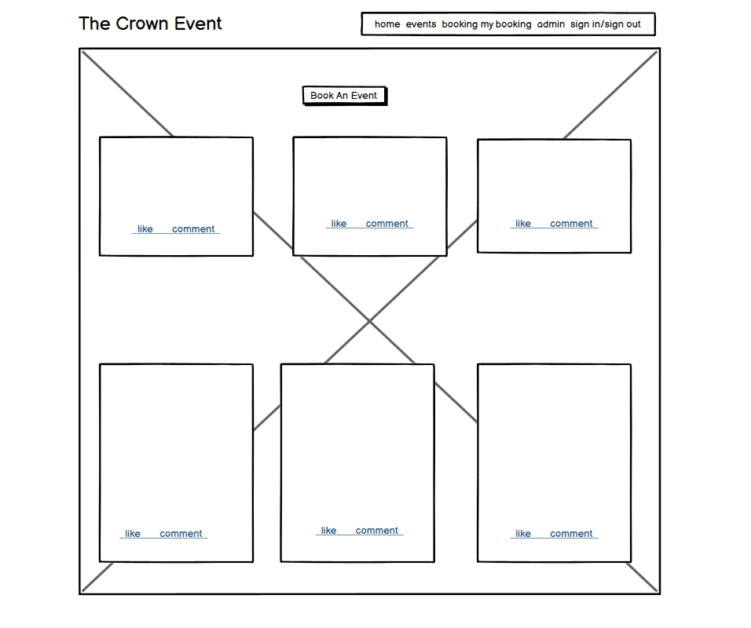
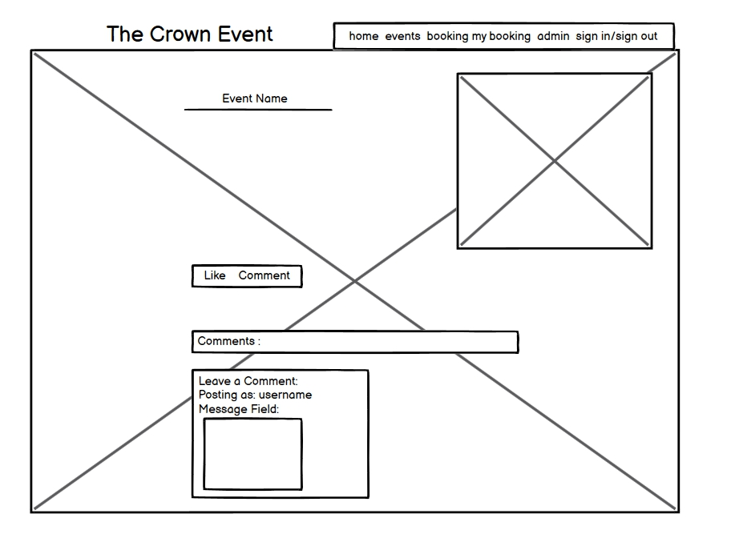
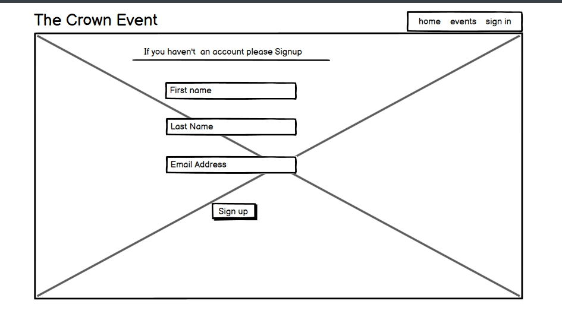
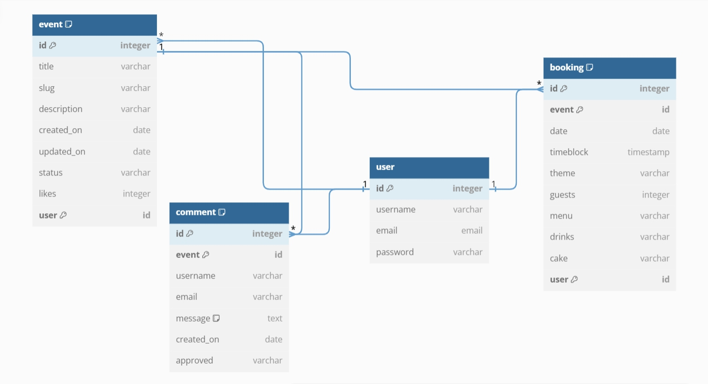

<h1 align = "center">THE CROWN EVENTS</h1><h3 align = "center">MAKE EVERY MOMENT MEMORABLE   AN EXCEPTIONAL EXPERIENCE EVERY TIME</h3> 

# Index - Table of Contents

- [Introduction](#introduction)  
- [User Experience (UX)](#user-experience-ux) 
- [Design](#design)
- [Agile Methodology](#agile-methodology)
- [Features](#features)
- [Features to be Implemented](#Features-to-be-Implemented)   
- [Technologies](#technologies)
- [Testing](#testing)
- [Deployment](#deployment)
- [Credits](#credits)

## Introduction

### [View Project](https://the-crown-event-d0c891afb09a.herokuapp.com/)   
This project is designed and developed to provide a great experience for the users who desire to plan and book an event. The users are given a variety of event choices to select from. They have the possibility to create, update and delete an event booking. They can post a review based on their experience after the event has taken place and like different events as well.

 

## User Experience (UX)

### User Stories 

- 02 : Site Navigation 
    - As a Site User I can see the Navigation bar so that I can easily navigate through the Website. 

- 06 :  Registration
    - As a Site User I can register an account so that I can explore the content and Book an Event. 

- 01 : View Event List
    - As a Site User I can view a list of Event so that I can read the details, likes and comments by other    
      users.  
 
- 03 : Open an Event
    - As a Site User I can click on an event so that I can read the details about the event. 

- 04 : View Likes
    - As a Site User/Admin I can view the number of likes on each event so that I can see which one is 
      popular or viral.  

- 05 : Read Comments
    - As a Site User/Admin I can view comments on an individual event so that I can read the             
      conversation. 

- 07 : Like/Unlike
   - As a Site User I can Like or Dislike an Event post so that I can help in improving the services provided. 

- 08 : Comment on Post
   - As a Site User I can comment on an event post so that I can give suggestions, reviews and recommendations.

- 11 : Approve Comments
   - As a Site Admin I can approve or disapprove comments so that I can filter out objectionable comments and 
     reviews  
   
- 12 : Booking 
   - As a Site User I can navigate to Booking so that I can Book an Event.

- 13 : Booking Approval
   - As an admin I can approve booking so that user can see his/her booking is approved. 

- 16 : View Previous Bookings
   - As a Site user I can check my previous bookings so that i can check the booking, update or delete them. 
   
- 14 : Edit Booking
   - As a Site User I can Edit so that i can update my booking. 

- 15 : Delete Booking
   - As a Site User I can delete my booking whenever i want to cancel my booking 

- 10 : Create Drafts
   - As a Site Admin I can create drafts so that I can add content to them later. 

- 09 : Manage Event Post
   - As a Site Admin I can create, read, update and delete more events, posts and comments so that I can make my 
     Site and Events better and my customers Happy and satisfied. 
      
## Features
### Existing Features

#### Navigation Bar
* The navigation bar is visible on the top of the web application. The logo is present on the top left and the navigation links are available on the top right. On accessing the application the user sees the links to Home, Events, Login and Sign Up. Once a user is loggedin there are additional navigation links added to the navigation bar that lead to the booking page and the my bookings page. In case of an admin user it also shows the link to the admin page.

 
  
#### Registration

* On accessing the webpage the user lands on the landing/home page and from their he/she can click on Sign Up on the top right corner in the navigation bar in order to go to the registration page. A Sign Up link is also provided in the center of the page that leads to the registration page too. A user needs to be registered in order to book an event.

  

* On the Sign Up page the user provides all the necessary data required for the registration process and clicks the Sign Up button. After a user is registered the application displays a message that the user has successfully signed in and directs the user to the application's home page.

  

#### Home Page

* The home page displays a beautiful image with a text overlay describing the essence of the event booking application. The All Events link present on the home page takes the user to the Events page. 

  

#### Events Page

* On the top of the events page you see an image in the background and a book and event button/link that directs the user to the event booking page.

  

#### Events List

* As you scroll down on the events page you see a list of events. The user can scroll through the list and click on an event in order to see the event details.

  
  

#### Events Detail

* On the event details page the user is provided with detailed information about the respective event and a varierty of different ideas along with planning and organisational tips in order to make the event a success for the user.

  
  

#### Likes on Event

* On clicking the heart icon the user can like the event and in the same way unlike it. The total number of current likes are always displayed under the heart icon.

  

#### Comments on Event

* The users are given the possibility to write a comment that is usually a review after the event has successfully taken place. The review is not displayed right away on the website. After a user posts a comment, it has to be approved by the admin. As soon as it is approved from the admin it is displayed under the respective event.

  
  

#### Event Booking

* On this page the user sees a form that contains all the data that is required in order to book an event. The user has to select the type of event and provide necessary information like no. of guests, date, time, menu, drinks, cake and theme. These are all required fields and all of them have to be entered/selected in order to submit the form and create a booking. On submission the user is directed to the events page and he/she sees a message saying that the booking is submitted successfully and waiting for approval. The admin user has to approve the booking in order for it to be visible under the my bookings page.

  

#### My Bookings

* All the user bookings are listed under the My Bookings page. On this page the user has the possibility to update or delete his/her bookings. The user is not able to access his/her bookings until he/she is logged in. 

  

#### Booking Update

* On clicking the Update button the user is directed to the update booking page. On this page the user is able to view the booking data and can update it by changing the respective data and clicking the update button. After a booking is updated it has to be approved by the admin. Once it is approved it is updated and displayed under my bookings.

  

#### Booking Cancellation

* On clicking the Cancel button the user is directed to the booking cancellation page. On this page the user is asked if he/she is sure about the cancellation and on clicking Cancel, the user is directed to the my bookings page and sees a message that the booking has been successfully cancelled.

  

#### Admin Event Post

* Using the admin interface the admin user is able to add more events, update and delete exising existing events.

  

#### Admin Booking Approval

* The admin user has to approve the booking in order for it to be visible under the my bookings page.

  

#### Admin Comment Approval

* The admin user has to approve the comments in order for them to be visible under the comments section of the events.

  

#### User Stories Chart

* The following is a traceability matrix cross-referencing the user stories with the features. It illustrates which features are based on which user stories :

  

## Design 

### Wireframes
- The wireframe diagrams below reflects the Home, Events, Event Detail, My Booking, Sign in, Sign out and Register 
  pages. 

Wireframes

#### DataBaseManagementSystem
The ER diagram shows the logical relationship between the different entities and makes it clear how the different entities are related to one another. 
* One user can create multiple bookings, like multiple events and add comments to multiple events. Hence there is a one to many relationship between a user and his bookings, likes and comments respectively.
* One event type can be booked by multiple users. Thus an event type can have multiple bookings making it a one to many relation.
* One event type can have multiple likes and comments making it a one to many relation.

  

## Agile Methodology
In order to use the agile methodology, the github project with linked issues was used. User stories were created and based on these user stories the project was created and brought to life. The stories were in todo and then were set to in progress while working on them and set to done once the work was done.
The link to the kanban board is as under:

[The Crown Event Agile Tool](https://github.com/users/ru22-14/projects/5)

## Technologies Used

#### languages

-   [HTML5](https://en.wikipedia.org/wiki/HTML5)
-   [CSS3](https://en.wikipedia.org/wiki/Cascading_Style_Sheets)
-   [Python](https://www.python.org/)

#### Frameworks & Liabraries

- [Google Fonts:](https://fonts.google.com/) used for the Roboto and Lato font.
- [Font Awesome:](https://fontawesome.com/) was used to add icons and for UX purposes.
- [dbdiagram.io](https://dbdiagram.io/home) was used to create the Entity Relationship diagrams for the application data model.
- [Balsamiq:](https://balsamiq.com/) was used to create the wireframes during design planning.
- [Git:](https://git-scm.com/) was used for version control by utilising the Gitpod terminal to commit to Git and Push to 
   GitHub.
- [GitHub:](https://github.com/) is used as the respository for the project code after being pushed from Git. In addition, for 
   this project GitHub was used for the agile development aspect through the use of User Stories (GitHub Issues) and tracking them on a Kanban board.
- [Heroku:](https://heroku.com/login) is used to deploy the project.  
- [Django](https://www.djangoproject.com/) was used as the framework to support rapid and secure development of the 
   application.
- [Bootstrap](https://getbootstrap.com/) was used to build responsive web pages.
- [Gunicorn](https://gunicorn.org/) was used as the Web Server to run Django on Heroku.
- [dj_database_url](https://pypi.org/project/dj-database-url/) library used to allow database urls to connect to the postgres 
  db.
- [psycopg2](https://pypi.org/project/psycopg2/) database adapter used to support the connection to the postgres db.
- [Cloudinary](https://cloudinary.com/) used to store the images used by the application.
- [Summernote](https://pypi.org/project/django-summernote/) used to provide WYSIWYG editing on the Hike editing screen.
- [Django allauth](https://django-allauth.readthedocs.io/en/latest/index.html) used for account registration and 
   authentication.
- [Django crispy forms](https://django-crispy-forms.readthedocs.io/en/latest/) used to simplify form rendering.
- [jquery library](https://ajax.googleapis.com/ajax/libs/jquery/1.12.4/jquery.min.js) used to fade out alert messages.
- [Django testing tools](https://docs.djangoproject.com/en/3.2/topics/testing/tools/) used for python mvt testing.
- [Jest](https://jestjs.io/) - used to test jquery in script.js.
- [coverage](https://coverage.readthedocs.io/en/coverage-5.5/) used to check how much of the python code has been covered.

## Testing

The testing documentation is provided in [TESTING.md](TESTING.md)

    

