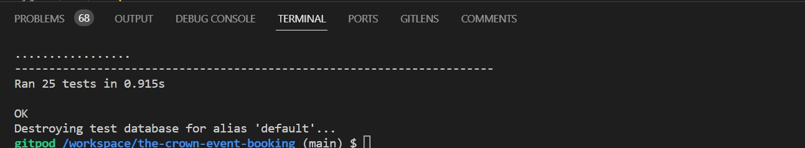
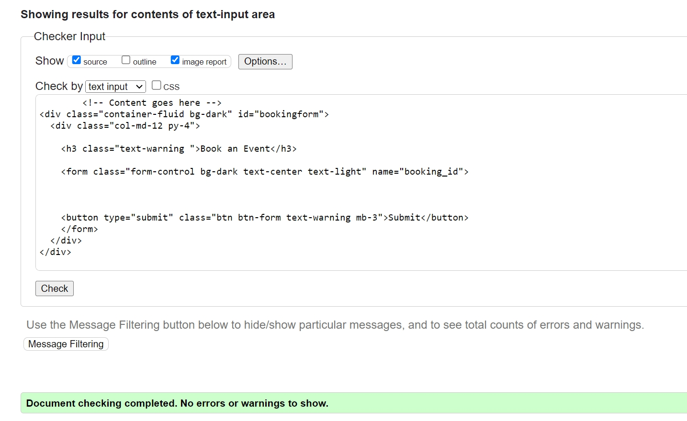
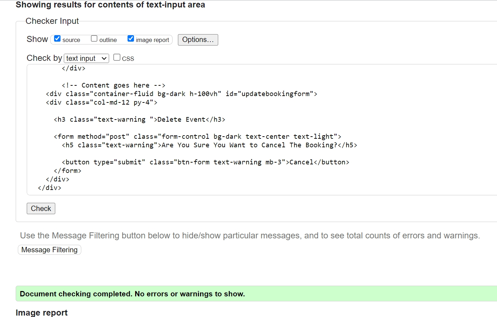
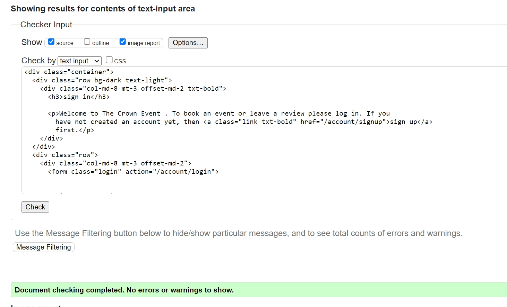
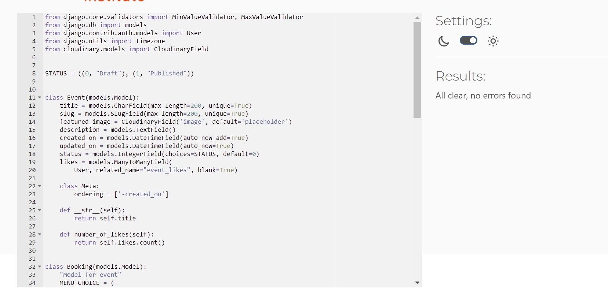
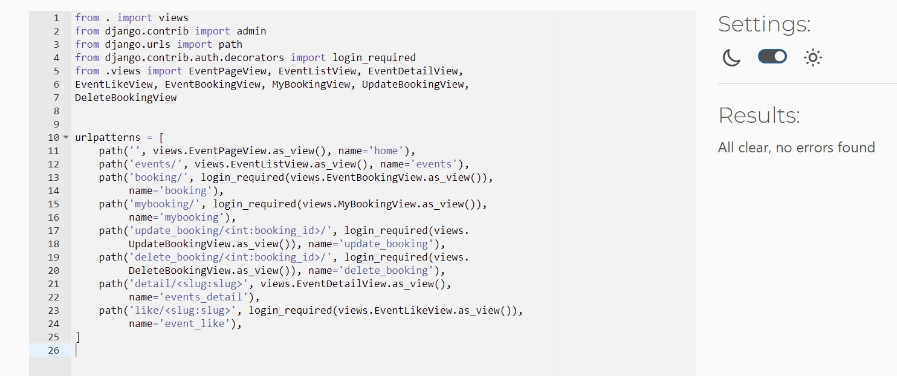
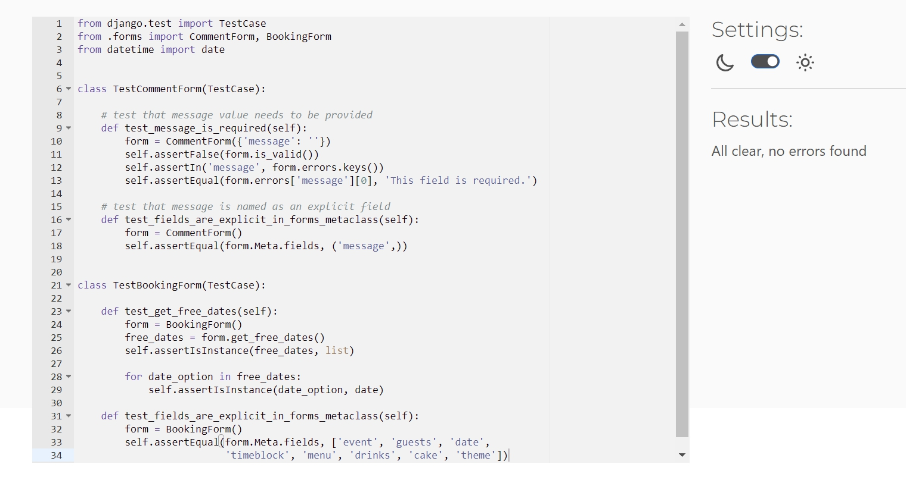

return to [README.md](README.md)
# Index - Table of Contents

- [Manual Testing](#manual-testing) 
- [Automated Testing](#automated-testing)
- [Validation Test](#validation-test)
- [Bugs](#bugs) 

## Manual Testing

These tests are based on user stories and features testing.  

### Site Navigation 
#### US02 : As a Site User I can see the Navigation bar so that I can easily navigate through the Website.  

- Acceptance Criteria:

- Overview:

- Outcome:

### Registration
#### US06 : As a Site User I can register an account so that I can explore the content and Book an Event.

- Acceptance Criteria:

- Overview:

- Outcome:

### View Event List
#### US01 : As a Site User I can view a list of Event so that I can read the details, likes and comments by    other.      
      
- Acceptance Criteria:

- Overview:

- Outcome:

### Open an Event
#### US03 : As a Site User I can click on an event so that I can read the details about the event.      
      
- Acceptance Criteria:

- Overview:

- Outcome:

### View Likes
#### US04 : As a Site User/Admin I can view the number of likes on each event so that I can see which one is popular or viral.     
      
- Acceptance Criteria:

- Overview:

- Outcome:

### Read Comments
#### US05 : As a Site User/Admin I can view comments on an individual event so that I can read the             conversation.   
      
- Acceptance Criteria:

- Overview:

- Outcome:

### Like/Unlike
#### US07 : As a Site User I can Like or Dislike an Event post so that I can help in improving the services provided.   
      
- Acceptance Criteria:

- Overview:

- Outcome:

### Comment on Post
#### US08 : As a Site User I can comment on an event post so that I can give suggestions, reviews and recommendations.   
      
- Acceptance Criteria:

- Overview:

- Outcome:

### Approve Comments
#### US11 :  As a Site Admin I can approve or disapprove comments so that I can filter out objectionable comments and reviews.   
      
- Acceptance Criteria:

- Overview:

- Outcome:

### Booking 
#### US12 :  As a Site User I can navigate to Booking so that I can Book an Event.   
      
- Acceptance Criteria:

- Overview:

- Outcome:

### Booking Approval
#### US13 :  As an admin I can approve booking so that user can see his/her booking is approved.   
      
- Acceptance Criteria:

- Overview:

- Outcome:

### View Previous Bookings
#### US16 : As a Site user I can check my previous bookings so that i can check the booking, update or delete them.    
      
- Acceptance Criteria:

- Overview:

- Outcome:

### Edit Booking
#### US14 :  As a Site User I can Edit so that i can update my booking.  
      
- Acceptance Criteria:

- Overview:

- Outcome:

### Delete Booking
#### US15 : As a Site User I can delete my booking whenever i want to cancel my booking 
      
- Acceptance Criteria:

- Overview:

- Outcome:

### Manage Event Post
#### US09 : As a Site Admin I can create, read, update and delete more events, posts and comments so that I can make my Site and Events better and my customers Happy and satisfied.
      
- Acceptance Criteria:

- Overview:

- Outcome:

## Automated Testing

   

   
Test Result

     
   
  
   

   
Failed Test

     
    I tried my best to make this test work but unfortunately it kept on failing. I searched alot to find a solution but couldnt make it work, then i asked my mentor for help but she couldnt help me either. Based on this experience i did not include 2 tests for urls.py with slug field because they were failing too so i decided to remove them from the test_urls.py. Any suggestion or solution will be highly appreciated.
   
  

  - Tests are written for the following files:  

  - [models.py](eventbooking/models.py)  test file: [test_models.py](eventbooking/models_forms.py)
  - [forms.py](eventbooking/forms.py)  test file: [test_forms.py](eventbooking/test_forms.py)
  - [views.py](eventbooking/views.py)  test file: [test_views.py](eventbooking/test_views.py)
  - [urls.py](eventbooking/urls.py)  test file: [test_urls.py](eventbooking/test_urls.py)

- Testing Coverage Report
  
    
## Validation Test

- [HTML Validator](https://validator.w3.org/)
  
- 

- Results of testing the Html Templates

   

   
Home Page

     
   

   

   
Events Page

     
   

   

   
EventDetail Page

     
   
  
   

   
Booking Page

     
   

   

   
MyBooking Page

     
   
  
   

   
booking Update Page

     
   
 
   

   
Booking Cancel Page

     
   
 
   

   
Account Page

     
   
   

- Result of testing CSS

- [CSS Validator](https://jigsaw.w3.org/css-validator/) 
   

   
CSS Validation

    
   
 

- Results of testing Python Code

- [Python Validator](https://pep8ci.herokuapp.com/)
   

   
Project Settings

     
   

   

   
Project Urls

     
   

   

   
Admin.py

     
   

   

   
Models.py

     
   

   

   
Views.py

     
   

   

   
Urls.py

     
   

   

   
Forms.py

     
   

   

   
Test_Models.py

     
   

   

   
Test_Views.py

     
   

   

   
Test_Forms.py

     
   

   

   
Test_Urls.py

     
   

### Bugs

- Currently there are no known bugs. 