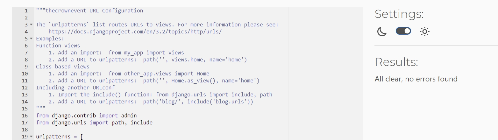

return to [README.md](README.md)

### Validation Test

- [HTML Validator](https://validator.w3.org/)
  
- 

- Results of testing the Html Templates

   

   
Home Page

     
   

   

   
Events Page

     
   

   

   
EventDetail Page

     
   
  
   

   
Booking Page

     
   

   

   
MyBooking Page

     
   
  
   

   
booking Update Page

     
   
 
   

   
Booking Cancel Page

     
   
 
   

   
Account Page

     
   
   

- Result of testing CSS

- [CSS Validator](https://jigsaw.w3.org/css-validator/) 
   

   
CSS Validation

     
   
  

- Results of testing Python Code

- [Python Validator](https://pep8ci.herokuapp.com/)
   

   
Project Settings

     
   

   

   
Project Urls

     
   

   

   
Admin.py

     
   

   

   
Models.py

     
   

   

   
Views.py

     
   

   

   
Urls.py

     
   

   

   
Forms.py

     
   

   

   
Test_Models.py

     
   

   

   
Test_Views.py

     
   

   

   
Test_Forms.py

     
   

   

   
Test_Urls.py

     
   

### Automated Test

   

   
Test Result

     
   

   

   
Failed Test

     
   

- Tests are written for the following files:  

  - [models.py](eventbooking/models.py)  test file: [test_models.py](eventbooking/models_forms.py)
  - [forms.py](eventbooking/forms.py)  test file: [test_forms.py](eventbooking/test_forms.py)
  - [views.py](eventbooking/views.py)  test file: [test_views.py](eventbooking/test_views.py)
  - [urls.py](eventbooking/urls.py)  test file: [test_urls.py](eventbooking/test_urls.py)

- Testing Coverage Report
  
    
