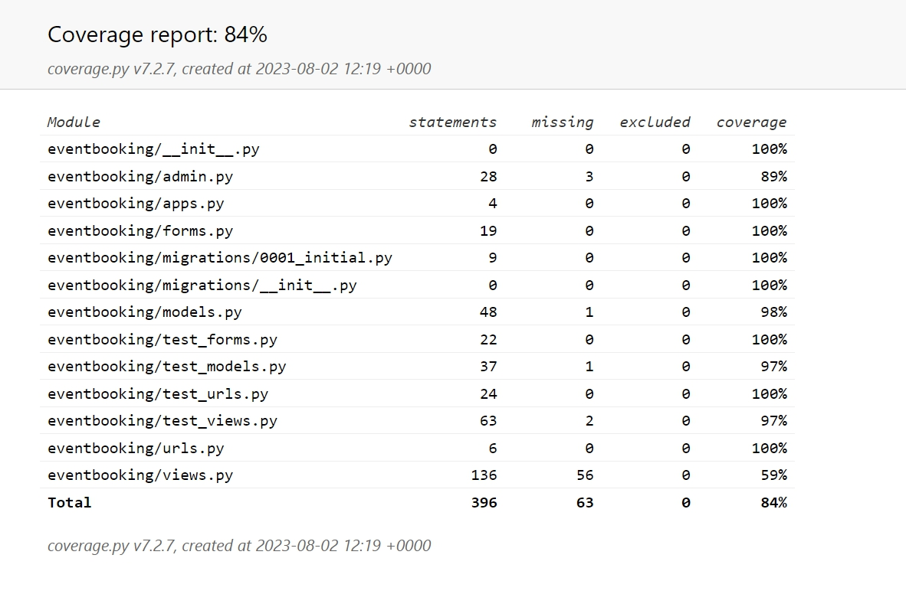
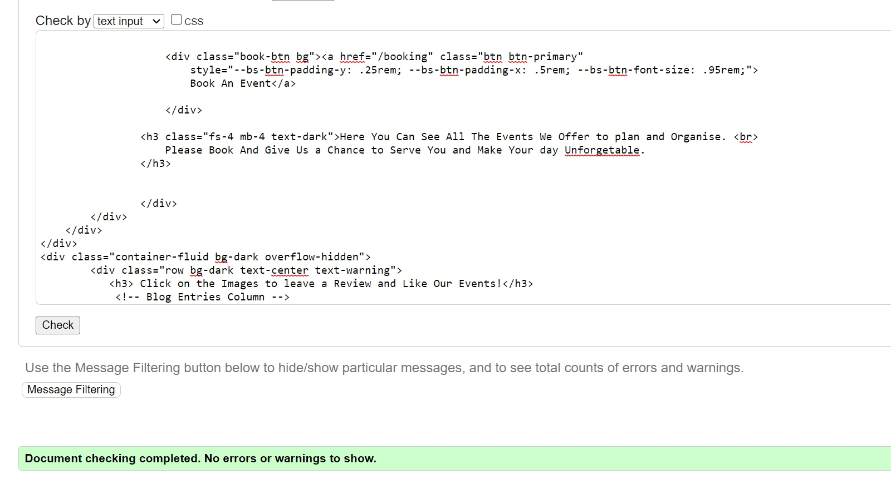
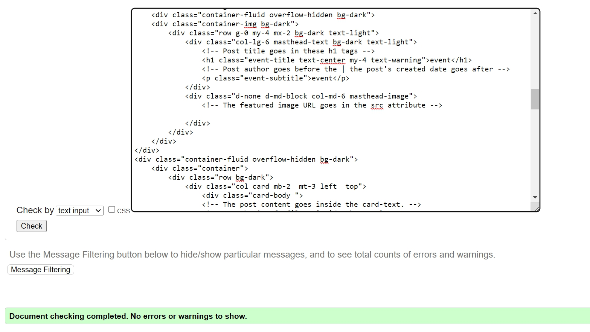
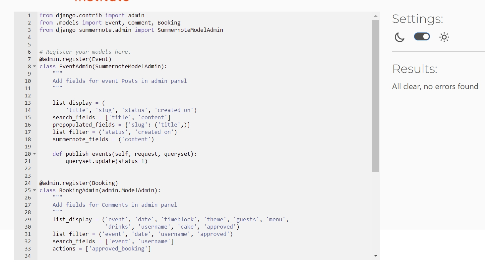
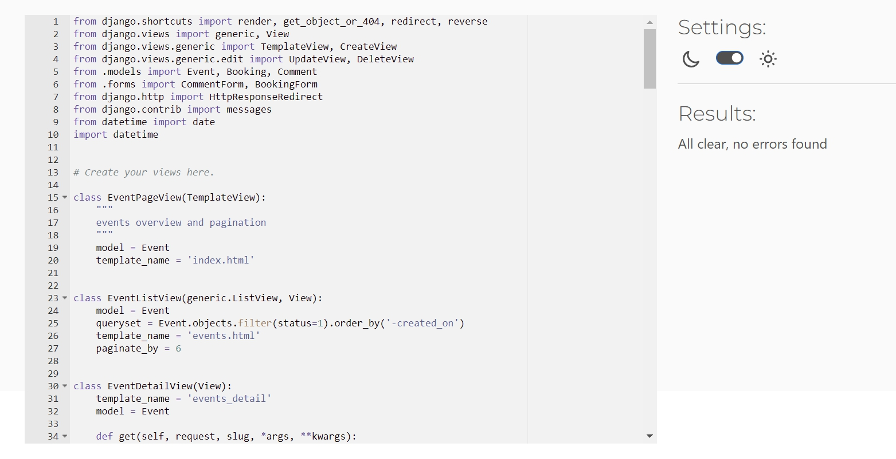
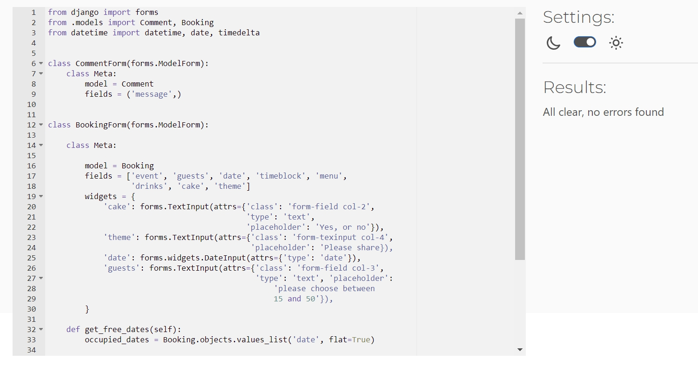
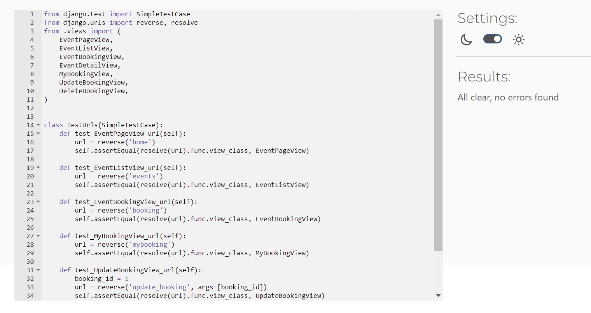

return to [README.md](README.md)
# Index - Table of Contents

- [Manual Testing](#manual-testing) 
- [Automated Testing](#automated-testing)
- [Validation Test](#validation-test)
- [Bugs](#bugs) 

## Manual Testing

These tests are based on user stories and features testing.  

### Site Navigation 
#### US02 : As a Site User I can see the Navigation bar so that I can easily navigate through the Website.  

- Acceptance Criteria: As a user i should be able to navigate through the website using the links in the navigation bar.

- Summary:
   - On visiting the website a user always sees the navigation bar on the top which enables them to navigate through the website easily.
   - When the user is not logged in they see the Home, Events, Login and Sign Up links only.
   - When the user is loggedin they have extra links such as Booking and My Bookings in the navigation bar.
   - When the user is loggedin as an admin they have apart from Booking and My Bookings an Admin link too in the navigation bar.
   
   By testing all the above cases in the summary, it is validated that the user story was completed
- Result: Pass

### Registration
#### US06 : As a Site User I can register an account so that I can explore the content and Book an Event.

- Acceptance Criteria: As a user i should be able to register and create an account in order to login and access the content of the website and be able to create an event booking.

- Summary:
   - There is a Sign Up page that provides a form with username, email and password for the user to fill in.
   - On filling the form correctly and submitting it, a user account is created.
   - A success message is displayed with the message "Succesfully signed in as..." that confirms that the user has been registered successfully and is loggedin.

   By testing all the above cases in the summary, it is validated that the user story was completed.

- Result: Pass

### View Event List
#### US01 : As a Site User I can view a list of Events so that I can read the details, likes and comments by    other.      
      
- Acceptance Criteria: As a user i should be able to view the list of events and their details along with the no. of likes and comments/reviews.

- Summary:
   - The Events page can be accessed by any type of user by clicking Events in the top navigation bar or All Events from the Home page.
   - A list of different events is displayed in the form of cards and it is visible to any type of user.
   - Every event card is provided with an image and a title of the event.

   By testing all the above cases in the summary, it is validated that the user story was completed.

- Result: Pass

### Open an Event
#### US03 : As a Site User I can click on an event so that I can read the details about the event.      
      
- Acceptance Criteria: As a user i should be able to view the details of the different events in the events list. 

- Summary:
   - On clicking an event card the user is able to view the event detail page.
   - On the event detail page the user sees and image and a detailed description about the respective event.
   - Under the event description the user is able to see the likes and comments related to the respective event.

   By testing all the above cases in the summary, it is validated that the user story was completed.

- Result: Pass

### View Likes
#### US04 : As a Site User/Admin I can view the number of likes on each event so that I can see which one is popular or viral.     
      
- Acceptance Criteria: As a user i should be able to view the number of likes on each event.

- Summary:
   - On the events list page the user is able to view the number of likes for all the events.
   - On the event detail page the user is able to view the number of likes for that particular event.

   By testing all the above cases in the summary, it is validated that the user story was completed.

- Result: Pass

### Read Comments
#### US05 : As a Site User/Admin I can view comments on an individual event so that I can read the             conversation.   
      
- Acceptance Criteria: As a user i should be able to view/read the comments that are written by others related to a specific event.

- Summary:
   - On the event detail page the user is able to view all the comments. These comments could be a user's own comments or from other users.

   By testing all the above cases in the summary, it is validated that the user story was completed.

- Result: Pass

### Like/Unlike
#### US07 : As a Site User I can Like or Dislike an Event post so that I can help in improving the services provided.   
      
- Acceptance Criteria: As a user i should be able to like/dislike an event.

- Summary:
   - On the event detail page the user is able to like an event by clicking the white heart icon. 
   - On the event detail page the user is able to unlike an event by clicking the black heart icon. 

   By testing all the above cases in the summary, it is validated that the user story was completed.

- Result: Pass

### Comment on Post
#### US08 : As a Site User I can comment on an event post so that I can give suggestions, reviews and recommendations.   
      
- Acceptance Criteria: As a user i should be able to post a comment/review for a specific event on the event detail page.

- Summary:
   - On the event detail page the user is able to write a comment/review in the text field that is provided and submit it by clicking the submit button. 
   - After it is successfully submitted the user see a succes message as "Thanks for your review".

   By testing all the above cases in the summary, it is validated that the user story was completed.

- Result: Pass

### Approve Comments
#### US11 :  As a Site Admin I can approve or delete comments so that I can filter out objectionable comments and reviews.   
      
- Acceptance Criteria: As an admin user i should be able to approve or delete comments giving me the oppurtunity to review the comments before making them available for all users.

- Summary:
   - An admin user is able to access the admin interface using the admin link in the navigation bar.
   - The admin user can goto the comments and select an entry and approve it.
   - In case of approval the comment is visible on the events detail page.
   - In case of deletion the comment is not visible on the events detail page.

   By testing all the above cases in the summary, it is validated that the user story was completed.

- Result: Pass

### Booking 
#### US12 :  As a Site User I can navigate to Booking so that I can Book an Event.   
      
- Acceptance Criteria: As a user i should be able to access the booking form in order to book an event.

- Summary:
   - On loggingin the user is able to access the booking form containing all the required data in order to create a booking.
   - On entering all the required data and submitting the form, a success message is displayed saying "Your booking is proposed successfully and waiting for the approval now".

   By testing all the above cases in the summary, it is validated that the user story was completed.

- Result: Pass

### Booking Approval
#### US13 :  As an admin I can approve booking so that user can see his/her booking is approved.   
      
- Acceptance Criteria: As an admin user i should be able to approve a booking requested by a user.

- Summary:
   - An admin user is able to access the admin interface using the admin link in the navigation bar.
   - The user can goto the bookings and click on an entry an then select approve and click save in order to approve the booking.
   - The user sees a message saying "The booking “....” was changed successfully."
   - After the booking is approved it is visible under the user's My Booking.
   
   By testing all the above cases in the summary, it is validated that the user story was completed.

- Result: Pass

### View Previous Bookings
#### US16 : As a Site user I can check my previous bookings so that i can check the booking, update or delete them.    
      
- Acceptance Criteria: As an user i should be able to view my bookings and be able to update or delete them.

- Summary:
   - The user can goto his bookings by click My Booking on the navigation bar.
   - The user can view all his bookings under the My Booking page.
   - The user can update a booking by clicking the Update button, he/she sees a message saying "Your booking is successfully updated" and the updated booking is visible.
   - The user can delete a booking by clicking the Cancel button, he/she sees a message saying "Your booking is successfully cancelled" and the booking is no longer visible.
   
   By testing all the above cases in the summary, it is validated that the user story was completed.

- Result: Pass

### Edit Booking
#### US14 :  As a Site User I can Edit so that i can update my booking.  
      
- Acceptance Criteria: As an user i should be able to update my bookings.

- Summary:
   - The user can goto his bookings by clicking My Booking on the navigation bar.
   - The user can update a booking by clicking the Update button, he/she sees a message saying "Your booking is successfully updated".
   - The updated booking is visible.
   
   By testing all the above cases in the summary, it is validated that the user story was completed.

- Result: Pass

### Delete Booking
#### US15 : As a Site User I can delete my booking whenever i want to cancel my booking 
      
- Acceptance Criteria: As an user i should be able to cancel my bookings.

- Summary:
   - The user can goto his bookings by clicking My Booking on the navigation bar.
   - The user can cancel a booking by clicking the Cancel button, he/she sees a message saying "Your booking is successfully cancelled".
   - The cancelled booking is not visible any longer.
   
   By testing all the above cases in the summary, it is validated that the user story was completed.

- Result: Pass

### Manage Event Post
#### US09 : As a Site Admin I can create, read, update and delete more events, posts and comments so that I can make my Site and Events better and my customers Happy and satisfied.
      
- Acceptance Criteria: As an admin user i should be able to view, create, update and delete events and posts/comments.

- Summary:
   - An admin user is able to access the admin interface using the admin link in the navigation bar.
   - The admin user can view, create, update and delete events.
   - The admin user can view, create, update and delete posts/comments..
   
   By testing all the above cases in the summary, it is validated that the user story was completed.

- Result: Pass

## Automated Testing

   

   
Test Result

     
   
  
   

   
Failed Test

     
    I tried my best to make this test work but unfortunately it kept on failing. I searched alot to find a solution but couldnt make it work, then i asked my mentor for help but she couldnt help me either. Based on this experience i did not include 2 tests for urls.py with slug field because they were failing too so i decided to remove them from the test_urls.py. Any suggestion or solution will be highly appreciated.
   
  

  - Tests are written for the following files:  

  - [models.py](eventbooking/models.py)  test file: [test_models.py](eventbooking/models_forms.py)
  - [forms.py](eventbooking/forms.py)  test file: [test_forms.py](eventbooking/test_forms.py)
  - [views.py](eventbooking/views.py)  test file: [test_views.py](eventbooking/test_views.py)
  - [urls.py](eventbooking/urls.py)  test file: [test_urls.py](eventbooking/test_urls.py)

- Testing Coverage Report
  
    
## Validation Test

- [HTML Validator](https://validator.w3.org/)
  
- 

- Results of testing the Html Templates

   

   
Home Page

     
   

   

   
Events Page

     
   

   

   
EventDetail Page

     
   
  
   

   
Booking Page

     
   

   

   
MyBooking Page

     
   
  
   

   
booking Update Page

     
   
 
   

   
Booking Cancel Page

     
   
 
   

   
Account Page

     
   
   

- Result of testing CSS

- [CSS Validator](https://jigsaw.w3.org/css-validator/) 
   

   
CSS Validation

    
   
 

- Results of testing Python Code

- [Python Validator](https://pep8ci.herokuapp.com/)
   

   
Project Settings

     
   

   

   
Project Urls

     
   

   

   
Admin.py

     
   

   

   
Models.py

     
   

   

   
Views.py

     
   

   

   
Urls.py

     
   

   

   
Forms.py

     
   

   

   
Test_Models.py

     
   

   

   
Test_Views.py

     
   

   

   
Test_Forms.py

     
   

   

   
Test_Urls.py

     
   

### Bugs

- Currently there are no known bugs. 